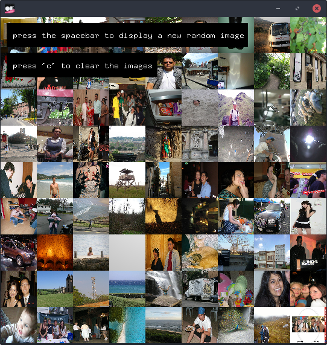

# ofxRandomImage

An addon for [openFrameworks](https://github.com/openframeworks/openFrameworks) to load a random image.

Its purpose is to celebrate randomness in the massive amount of existing image data online.



## Usage
Before you can use the addon please read the section **API keys** and make sure they are added to your app.
```c++
// ofApp.h

#include "ofxRandomImage.h"

class ofApp : public ofBaseApp{

	//..

	ofxRandomImage randomImage;
	ofImage img;

}
```

```c++
// ofApp.cpp

void setup(){

	randomImage.setup();
	randomImage.loadRandomImage(img);

}

void draw(){

	if(img.isAllocated()){
		img.draw();
	}

}
```

## Sources and methods

It currently supports the following sources:
* **Flickr** <br> Random images from flickr are retrieved by picking a random number between zero and the ID of the newest image. If no image with this number as its ID exists, the process is repeated. (This can take a view tries)
* **Google Image Search (IN WORK, NOT YET UPLOADED)**<br>The Google Image Search will adapt the method of Dave Mattsons [Random Personal Picture Finder](http://www.diddly.com/random/random.html): It creates a random string that has the format used by default in a few different digital cameras. The image search for such a term returns raw and completely random everyday life snapshots.

## API keys
In order to use the APIs you need to get API keys. These are the pages where you can get them:
* **Flickr**<br>https://www.flickr.com/services/developer/api/ (max. 3600 queries per hour)

Let the addon know your keys by adding a file called `apikeys.xml` to the folder `bin/data` in your app. It should look like this, insert your keys there:
```xml
<apikeys>
	<flickr>XXX</flickr>
</apikeys>
```

## Disclaimer

Use this addon at your own risk. The search providers do not own the images found via their search. You must contact the owner of an image and obtain his/her permission in order to use it. Please take care yourself that you do not violate any copyright.
